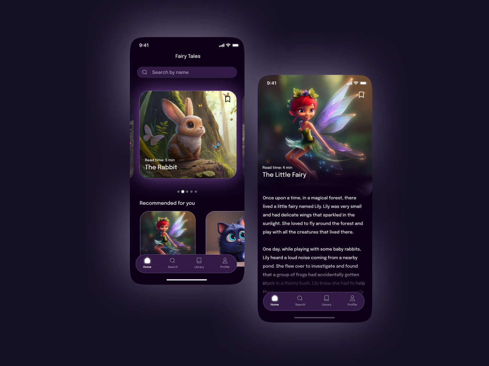

# Fairy Tale Maui



## Introduction

Fairy Tale Maui is a .NET Maui project that serves as a user interface (UI) challenge. The project is designed to showcase the capabilities of .NET Maui, a cross-platform framework for building native apps for iOS, Android, macOS, and Windows.

## Project Overview

This project is part of a UI challenge, and it includes a Figma design file for the UI layout. You can find the UI challenge file on Figma [here](https://www.figma.com/file/iI1NOiSfEyzj81dhp7XzW2/Fairy-Tale-FREEBIE-(Community)?node-id=101%3A20&mode=dev).

## Features

- Cross-platform compatibility: This project demonstrates how .NET Maui allows you to create native applications for multiple platforms with a single codebase.
- Beautiful UI design: The Figma design file provided offers a visually appealing user interface that you can use as a reference or customize to your needs.
- Open-source: Feel free to fork, clone, or contribute to this project. We welcome contributions and improvements.

## Getting Started

To get started with the Fairy Tale Maui project, follow these steps:

1. Clone the repository to your local machine:

   ```bash
   git clone https://github.com/your-username/FairyTaleMaui.git

## Prerequisites

Before you start working on this project, make sure you have the following prerequisites installed:

- [.NET 8 SDK](https://dotnet.microsoft.com/download/dotnet/8.0)
- [Visual Studio 2022](https://visualstudio.microsoft.com/) or [Visual Studio for Mac](https://visualstudio.microsoft.com/visual-cpp-for-mac/) (or any IDE that supports .NET Maui development)
